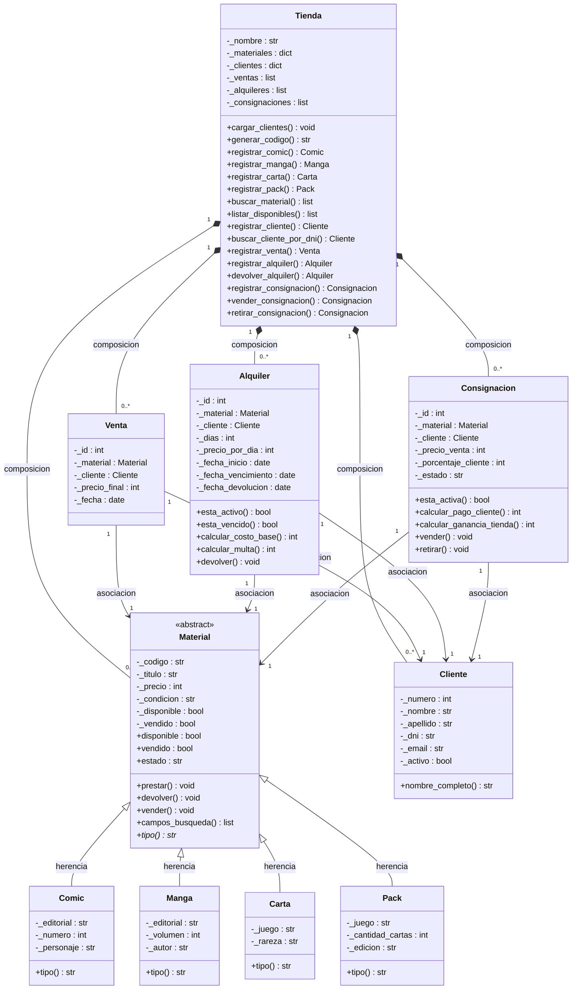

# El Universo — Sistema de gestión de tienda de cómics

Sistema por consola para gestionar una tienda de cómics y coleccionables. Desarrollado en Python 3, sin librerías externas.

Soporta tres tipos de operaciones:
- **Ventas**: registro de ventas del stock propio de la tienda
- **Alquileres**: préstamo temporal con cálculo de multa por atraso
- **Consignaciones**: un cliente trae su propio artículo para que la tienda lo venda; al concretarse, cobra su porcentaje acordado

Los clientes se guardan en `clientes.json` y persisten entre sesiones.

---

## Cómo ejecutar

```bash
python main.py
```

Requiere Python 3.10 o superior. Sin dependencias externas.

Al arrancar, el sistema carga 40 artículos de ejemplo (13 cómics, 11 mangas, 11 cartas y 5 packs) y lee los clientes desde `clientes.json`.

---

## Estructura del proyecto

```
main.py          — menú por consola
tienda.py        — fachada del sistema: toda la lógica de negocio pasa por acá
material.py      — jerarquía de artículos: Material (abstracta), Comic, Manga, Carta, Pack
cliente.py       — clase Cliente
transaccion.py   — Venta, Alquiler y Consignacion
datos_ejemplo.py — artículos y transacciones de demo (se carga al iniciar)
clientes.json    — base de datos de clientes (se actualiza automáticamente)
```

---

## Estado inicial al arrancar

El sistema arranca con 5 transacciones de ejemplo ya cargadas:

| # | Tipo | Artículo | Cliente |
|---|------|----------|---------|
| Venta #1 | Venta | Batman: Year One | Lionel Messi |
| Alquiler #1 | Alquiler (7 días) | One Piece Vol. 1 | Angel Di Maria |
| Alquiler #2 | Alquiler (3 días) | Saga #1 | Javier Mascherano |
| Consignación #1 | Consignación | Mox Sapphire — $45.000 (75% cliente → $33.750) | Lautaro Martinez |
| Consignación #2 | Consignación | The Dark Knight Returns — $7.000 (70% cliente → $4.900) | Emiliano Martinez |

---

## Flujo de prueba por operación

### Consignación completa
1. **Consignaciones → 3** (ver activas): vas a ver los IDs disponibles
2. **Consignaciones → 2** (registrar venta): ingresás el ID, el sistema muestra cuánto le corresponde al cliente
3. **Consignaciones → 4** (ver vendidas): confirmás que quedó registrada

Para devolver un artículo sin vender: **Consignaciones → 5** (muestra la lista y pedí el ID).

### Alquiler y devolución
1. **Alquileres → 1**: ingresás código del artículo, DNI del cliente, días y precio/día
2. **Alquileres → 2**: muestra los alquileres activos, elegís el ID para registrar la devolución
3. Si ya venció la fecha, **Alquileres → 4** muestra los vencidos con la multa acumulada

### Venta directa
**Ventas → 1**: pedí código del artículo y DNI del cliente. Si el cliente no está registrado, lo podés agregar en el momento.

---

## Diagrama de clases


