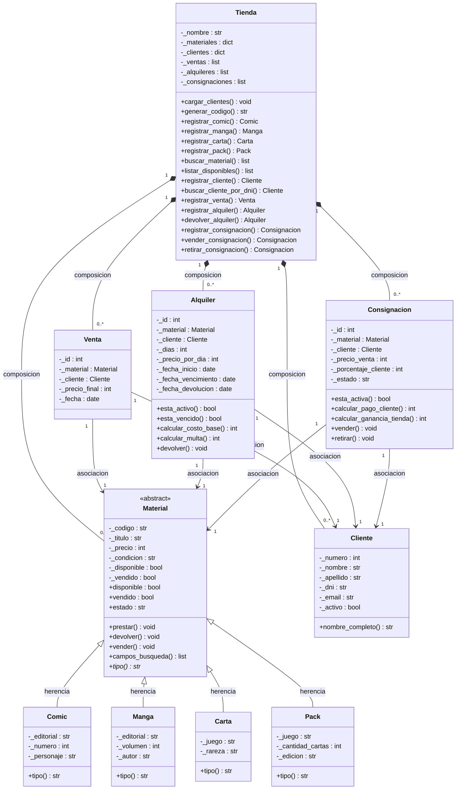

# CCM — Sistema de gestión de tienda de cómics, cartas y manga

Sistema de gestión por consola desarrollado en Python 3, sin librerías externas. Permite administrar el catálogo de una tienda de coleccionables y registrar tres tipos de operaciones: ventas, alquileres y consignaciones.

---

## Cómo ejecutar

```bash
python main.py
```

Requiere Python 3.10 o superior. Al iniciar, el sistema carga un catálogo de artículos de ejemplo y lee los clientes registrados desde `clientes.json`.

---

## Funcionalidades

### Catálogo
- Agregar artículos de cuatro tipos: **Comic**, **Manga**, **Carta** y **Pack de cartas**
- Buscar artículos por título, editorial, personaje, autor, juego u otros campos según el tipo
- Listar artículos disponibles o ver el catálogo completo con su estado actual

### Clientes
- Registrar clientes con nombre, apellido, DNI, email, teléfono y dirección
- Buscar cliente por DNI
- Los clientes persisten entre sesiones en `clientes.json`
- Al registrar una operación, si el cliente no existe se puede dar de alta en el momento

### Ventas
- Registrar la venta definitiva de un artículo del catálogo propio a un cliente
- Ver historial completo de ventas

### Alquileres
- Registrar el préstamo temporal de un artículo indicando días y precio por día
- Registrar la devolución de un alquiler activo
- Ver alquileres activos y alquileres vencidos
- Cálculo automático de multa por días de atraso en la devolución

### Consignaciones
- Recibir un artículo de un cliente para que la tienda lo venda en su nombre
- Configurar el precio de venta y el porcentaje que le corresponde al cliente (default: 70%)
- Registrar la venta del artículo en consignación, con cálculo automático del pago al cliente y la ganancia de la tienda
- Devolver el artículo al cliente si decide retirarlo sin vender
- Ver consignaciones activas y vendidas

---

## Estructura del proyecto

```
main.py          — menú por consola, punto de entrada
tienda.py        — fachada del sistema: toda la lógica de negocio
material.py      — jerarquía de artículos: Material (abstracta), Comic, Manga, Carta, Pack
cliente.py       — clase Cliente
transaccion.py   — Venta, Alquiler, Consignacion
datos_ejemplo.py — catálogo y transacciones de demo
clientes.json    — base de datos de clientes (se actualiza automáticamente)
```

---

## Diseño orientado a objetos

### Jerarquía de artículos

`Material` es una clase abstracta que define el comportamiento común a todos los artículos: código, título, precio, condición física y estado de disponibilidad. No puede instanciarse directamente.

Cada subclase agrega los atributos propios de su tipo e implementa el método abstracto `tipo()`:

| Clase | Atributos específicos |
|-------|-----------------------|
| `Comic` | editorial, número de edición, personaje/serie |
| `Manga` | editorial, volumen, autor |
| `Carta` | juego, rareza |
| `Pack` | juego, cantidad de cartas, edición |

El estado de un artículo sigue este flujo:

```
Disponible ──► Alquilado  ──► Disponible   (tras devolución)
           └──► Vendido                    (estado final)
```

### Transacciones

Cada tipo de operación es una clase independiente con su propia lógica:

- **`Venta`**: registra artículo, cliente, precio y fecha.
- **`Alquiler`**: registra días pactados, precio por día, fecha de vencimiento y devolución. Calcula multa si hay atraso.
- **`Consignacion`**: registra precio de venta y porcentaje acordado. Calcula el pago al cliente y la comisión de la tienda al momento de la venta.

### Tienda como fachada

La clase `Tienda` centraliza toda la lógica de negocio. El menú (`main.py`) interactúa únicamente con esta clase, sin acceder directamente a los artículos, clientes ni transacciones. Antes de cada operación, `Tienda` valida disponibilidad del artículo, estado del cliente y consistencia de los datos.

---

## Diagrama de clases


